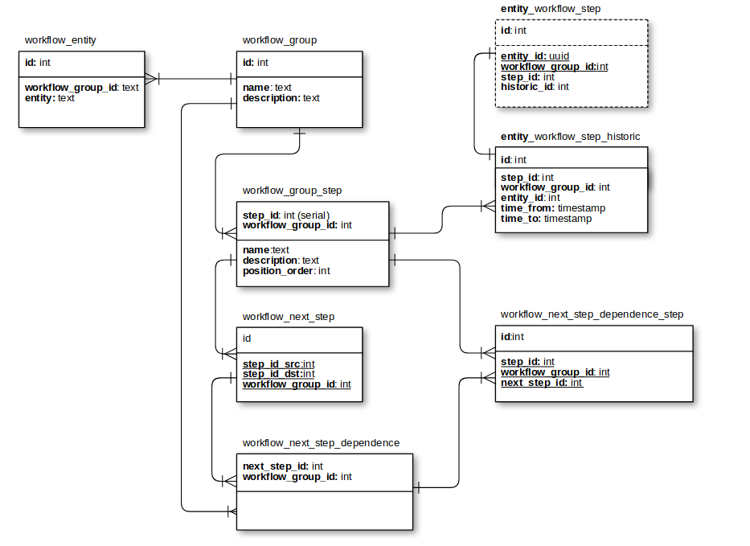
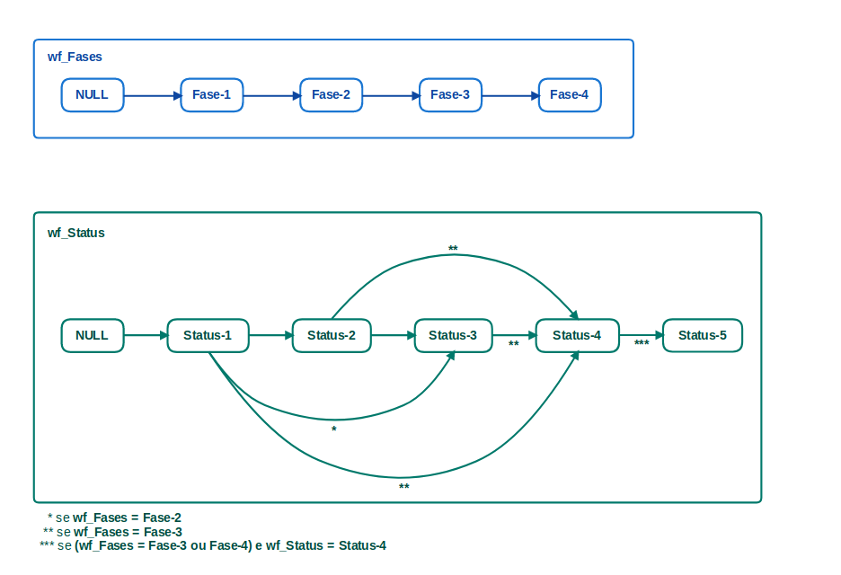

# Gerenciamento de WorkFlow (fluxo de trabalho)
:shipit:

O script [workflow_check.sql](workflow_check.sql)
 contém as tabelas e funções para criar a estrutura básica do gerenciamento de fluxos de trabalho de forma genérica, permitindo que o usuário possa criar e organizar de forma genérica os seus próprios fluxos.

De forma geral teremos as seguintes entidades

| Entidades                         	| Tipo   	| Descrição                                                                                   	|
|-----------------------------------	|--------	|---------------------------------------------------------------------------------------------	|
| workflow_group                    	| tabela 	| Registra os workflows que serão gerenciados.                                                	|
| workflow_entity                   	| tabela 	| Registra o nome das tabelas que mantêm o status atual para cada workflow                 	|
| workflow_group_step               	| tabela 	| Registra cada uma dos passos presente em um  determinado workflows                       	|
| workflow_next_setp                	| tabela 	| Registra como será a interação entre os passos                                              	|
| workflow_next_step_dependence    	| tabela 	| Registra as dependencias de quais workflows um determinado   passo é depedente           	|
| workflow_next_step_dependence_step 	| tabela 	| Registra as dependencias para que uma interação  entre os passos possa acontecer         	|
| workflow_check_change_step        	| função 	| Função que verifica se uma alteração em um dos  passos sobre um registro é válida.       	|
| workflow_insert_historic          	| função 	|  Função que atualiza o histórico de alterações de   um workflows sobre um registro 	|

o modelo de relacionamento entre as entidade é definido como:

## Exemplo de workflow
Os dois workflows mostrado na figura serão utilizado como referencia no exemplo:

### tabela: `workflow_group`

| id 	| name      	| description     	|
|----	|-----------	|-----------------	|
| 1  	| wf_Fases  	| workflow fases  	|
| 2  	| wf_Status 	| workflow status 	|

### tabela: `workflow_group_step`

| step_id 	| workflow_group_id 	| name     	| position_order 	| description 	|
|---------	|-------------------	|----------	|----------------	|-------------	|
| 1       	| 1                 	| Fase-1   	| 1              	| Fase 1      	|
| 2       	| 1                 	| Fase-2   	| 2              	| Fase 2      	|
| 3       	| 1                 	| Fase-3   	| 3              	| Fase 3      	|
| 4       	| 1                 	| Fase-4   	| 4              	| Fase 4      	|
| 5       	| 2                 	| Status-1 	| 1              	| Status 1    	|
| 6       	| 2                 	| Status-2 	| 2              	| Status 2    	|
| 7       	| 2                 	| Status-3 	| 3              	| Status 3    	|
| 8       	| 2                 	| Status-4 	| 4              	| Status 4    	|
| 9       	| 2                 	| Status-5 	| 5              	| Status 5    	|

### tabela: `workflow_next_step`

| id 	| step_id_src 	| step_id_dst 	| workflow_group_id 	|
|----	|-------------	|-------------	|-------------------	|
| 1  	| NULL        	| 1           	| 1                 	|
| 2  	| 1           	| 2           	| 1                 	|
| 3  	| 2           	| 3           	| 1                 	|
| 4  	| 3           	| 4           	| 1                 	|
| 5  	| NULL        	| 5           	| 2                 	|
| 6  	| 5           	| 6           	| 2                 	|
| 7  	| 6           	| 7           	| 2                 	|
| 8  	| 7           	| 8           	| 2                 	|
| 9  	| 8           	| 9           	| 2                 	|
| 10 	| 5           	| 7           	| 2                 	|
| 11 	| 5           	| 8           	| 2                 	|
| 12 	| 6           	| 8           	| 2                 	|

### tabela: `workflow_next_step_dependence`

| next_step_id 	| workflow_group_id 	|
|--------------	|-------------------	|
| 10           	| 1                 	|
| 8            	| 1                 	|
| 11           	| 1                 	|
| 12           	| 1                 	|
| 9            	| 1                 	|
| 9            	| 2                 	|

### tabela: `workflow_next_step_dependence_step`

| id 	| step_id 	| workflow_group_id 	| next_step_id 	|
|----	|---------	|-------------------	|--------------	|
| 1  	| 2       	| 1                 	| 10           	|
| 2  	| 3       	| 1                 	| 11           	|
| 3  	| 3       	| 1                 	| 8            	|
| 4  	| 3       	| 1                 	| 12           	|
| 5  	| 3       	| 1                 	| 9            	|
| 6  	| 4       	| 1                 	| 9            	|
| 7  	| 8       	| 2                 	| 9            	|

O arquivo [create-wf.sql](example/create-wf.sql) tem os insert para criar a estrutura dos workflows de exemplo.
> obs. os comando `INSERT` poder fazer com que a sequência de auto incremento fique inconsistente.